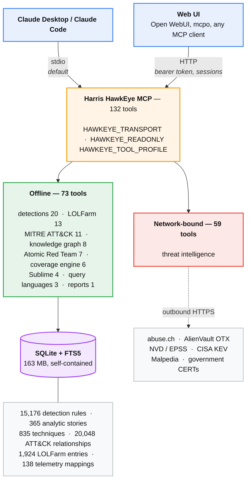
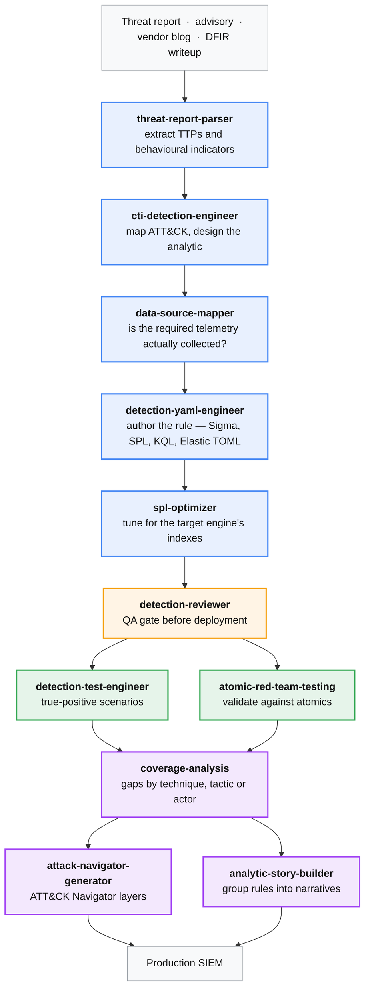

# Harris HawkEye MCP

**Detection Engineering Command Center for Claude Code**

A Model Context Protocol (MCP) server purpose-built for detection engineers. Indexes 15,100+ detection rules from five major detection ecosystems (Sigma, KQL/Sentinel, Splunk ESCU, Elastic, Sublime), enriches them with MITRE ATT&CK v18.1, Atomic Red Team, LOLBAS, LOLFarm (lolol.farm), and 15+ threat intelligence sources — then exposes everything through 132 tools and 15 project-scoped Claude Code skills that implement the full detection engineering lifecycle.

The primary output is **kill-chain correlated queries** (KQL + SPL + Sigma), not isolated atomic rules.


-brightgreen)


---

## What It Does

| Capability | Description |
|---|---|
| **Multi-source detection search** | Query 15,176 rules (KQL 5,509 · Sigma 4,030 · Elastic 2,218 · Splunk ESCU 2,185 · Sublime 1,234) plus 365 Splunk analytic stories, from one interface |
| **MITRE ATT&CK enrichment** | 835 techniques, 187 groups, 787 software, 52 campaigns, 20,048 relationships — all local, all queryable |
| **Atomic Red Team validation** | Indexes and cross-references Atomic Red Team tests against detection rules. **Deliberately not populated** — the sync clones a repository of working attack payloads, which raises EDR alerts. Enable it knowingly |
| **LOLFarm intelligence** | Aggregates Living-Off-The-Land data from 7 sources: LOLDrivers (697), HijackLibs (609), LOLRMM (319), LOLBAS (244), LoFP, WADComs, LOTS, MalAPI — 1,924 entries. Four upstream URLs currently return 404, so LoFP, WADComs, LOTS and MalAPI hold seed data only |
| **LOLBAS hard gate** | Every binary-scoped rule must enumerate all known abuse patterns before a single condition is written |
| **Threat intelligence** | 15+ sources: abuse.ch (URLhaus, ThreatFox, MalwareBazaar), AlienVault OTX, CISA/FBI/NSA/NCSC-UK/CERT-EU, Malpedia, NVD/EPSS, ANY.RUN |
| **CVE-to-detection** | Input a CVE ID → get KQL, SPL, and Sigma rules with EPSS scores and KEV status |
| **Coverage engine** | 138 telemetry mappings, 4-state classification (COVERED/DETECTABLE/PARTIAL/GAP), Pareto-optimal log source recommendations |
| **Knowledge graph** | Persist decisions, learnings, and entity relationships across sessions — tribal knowledge that compounds |
| **Kill-chain synthesis** | Stitch atomic rules into correlated multi-phase queries that fire on full attack sequences, not individual events |

---

## Architecture



The split that matters operationally: **73 of the 132 tools work with no network at all** — every
detection search, MITRE lookup, LOLFarm query and translation brief reads the local database. The
59 threat-intelligence tools call external APIs and will fail on an air-gapped or proxied host,
which is why `phase1-authoring` excludes them.

The database is self-contained. Rules, MITRE, LOLFarm, Sublime, the coverage mappings and the
full-text index all live in that one file, so migrating an installation means copying it — the rule
repositories are only needed to build or refresh it, never to run.

---

## Quick Start

> Deploying to another machine, or moving an existing install? Follow
> **[docs/MIGRATION-SOP.md](docs/MIGRATION-SOP.md)** instead — it covers the database, which is not
> in this repository, and the transport and verification steps in order.

### Prerequisites
- Node.js 18+
- Claude Desktop or Claude Code

### Installation

```bash
git clone https://github.com/legionultramax/Detection-Engineering-MCP.git
cd Detection-Engineering-MCP

# Install dependencies
npm install

# Build
npm run build
```

### Download Detection Rules

Clone the four rule repositories into the `rules/` directory:

```bash
# SigmaHQ
git clone https://github.com/SigmaHQ/sigma.git rules/sigma

# Splunk Security Content (ESCU)
git clone https://github.com/splunk/security_content.git rules/splunk

# Elastic Detection Rules
git clone https://github.com/elastic/detection-rules.git rules/elastic

# Azure Sentinel (KQL)
git clone https://github.com/Azure/Azure-Sentinel.git rules/sentinel
```

### Configure Claude Desktop

Add to `%APPDATA%\Claude\claude_desktop_config.json` (Windows) or `~/Library/Application Support/Claude/claude_desktop_config.json` (macOS):

```json
{
  "mcpServers": {
    "harris-hawkeye": {
      "command": "node",
      "args": ["<path-to>/security-detections-mcp/dist/index.js"],
      "env": {
        "SIGMA_PATHS": "<path-to>/security-detections-mcp/rules/sigma/rules",
        "SPLUNK_PATHS": "<path-to>/security-detections-mcp/rules/splunk/detections",
        "ELASTIC_PATHS": "<path-to>/security-detections-mcp/rules/elastic/rules",
        "KQL_PATHS": "<path-to>/security-detections-mcp/rules/sentinel/Hunting Queries",
        "STORY_PATHS": "<path-to>/security-detections-mcp/rules/splunk/stories"
      }
    }
  }
}
```

Restart Claude Desktop after configuration. On first launch the server indexes the rules it can find, which takes a few minutes against local files.

> Add `"HAWKEYE_SKIP_SYNC": "1"` to that `env` block unless you specifically want the Atomic Red
> Team and Sublime git syncs. They use blocking calls, so an unreachable remote stalls the MCP
> handshake for the full git timeout and the client sees a server that connected and then went
> quiet.

### Environment Variables

> **There is no `.env` support.** The project has no `dotenv` dependency and reads no `.env` file —
> one you create will be silently ignored. Variables must be in the process environment: the `env`
> block of an MCP client config, a systemd unit, a wrapper script, or your shell.
>
> **Use absolute paths.** Relative paths resolve against whatever working directory the client sets,
> which is not necessarily the repository.

**Database and indexing**

| Variable | Description | Required |
|---|---|---|
| `DETECTIONS_DB_PATH` | Absolute path to `detections.db`. Defaults to `~/.cache/security-detections-mcp/detections.db` — set it explicitly | Recommended |
| `SIGMA_PATHS` | Comma-separated paths to Sigma rule directories | To index |
| `SPLUNK_PATHS` | Comma-separated paths to Splunk ESCU detection directories | To index |
| `ELASTIC_PATHS` | Comma-separated paths to Elastic rule directories | To index |
| `KQL_PATHS` | Sentinel KQL directories (auto-discovers sibling `Detections/` and `Solutions/`) | To index |
| `STORY_PATHS` | Path to Splunk analytic stories | Optional |
| `SUBLIME_REPO_PATH` | Where `sublime_sync` clones the rules. Point it outside any synced folder | Optional |

**Deployment controls**

| Variable | Description |
|---|---|
| `HAWKEYE_READONLY=1` | The database file is never modified — enforced by SQLite, not by convention. Startup indexing and upstream sync are skipped, and the 8 write tools are withheld from the tool list. Refuses to start against an empty database. **Use this for any shared or hosted instance.** |
| `HAWKEYE_TOOL_PROFILE` | `phase1-authoring` (27 tools), `research` (all reads), `full` (default). An unrecognised name is fatal at startup rather than silently exposing everything |
| `HAWKEYE_SKIP_SYNC=1` | Keeps local indexing but skips the Atomic Red Team and Sublime git pulls. Implied by read-only |
| `HAWKEYE_TRANSPORT` | `stdio` (default, what Claude Desktop uses) or `http` |
| `HAWKEYE_HTTP_HOST` | Bind address for HTTP, default `127.0.0.1` |
| `HAWKEYE_HTTP_PORT` | Default `8765` |
| `HAWKEYE_HTTP_TOKEN` | Bearer token, compared in constant time. **Required to bind a non-loopback address** — the server refuses to start otherwise |
| `HAWKEYE_HTTP_PATH` | MCP endpoint path, default `/mcp` |

**Optional API keys**

| Variable | Description |
|---|---|
| `OTX_API_KEY` | AlienVault OTX ([free](https://otx.alienvault.com)) |
| `MALPEDIA_API_KEY` | Malpedia ([free](https://malpedia.caad.fkie.fraunhofer.de)) |

### Why `HAWKEYE_TOOL_PROFILE` matters

The full surface is 132 tools — a 66 KB `tools/list` payload, on the order of 19,000 tokens. That
fits comfortably in a large context window, so context is not the constraint — **discrimination is**.
Eleven `lookup_*` LOLFarm tools, thirteen `otx_*`/`threatfox_*`/`bazaar_*` variants, and four
plausible answers to "find me rules for credential dumping" degrade tool selection well before the
window runs out.

`phase1-authoring` is 27 tools and a 14.8 KB payload — a 78% reduction — chosen so that every fact a
detection hypothesis rests on is retrievable and nothing else is. It deliberately excludes the
network-bound threat-intel vendors, every knowledge-graph write, and the report generators.

The reduction is in routing pressure, not context. Cutting 105 near-neighbour tool names is the
point; the ~15,000 tokens saved is a side effect. `npm run verify:readonly` prints the measured
payload size, so this figure is checkable rather than asserted.

### Verify before wiring a client to it

```bash
npm run lint            # tsc --noEmit --strict
npm run tools:check     # tool count matches the documentation
npm run verify:readonly # 53 checks — read-only really is read-only
npm run verify:search   # 36 checks — FTS5, ranking, injection safety
npm run verify:queries  # 94 checks — language specs and the validation gate
npm run verify:coverage # 16 checks — translation brief coverage
npm run verify:http     # 26 checks — the HTTP transport, on an ephemeral port
npm test                # 138 checks (needs a writable database)
```

All of these are local and offline. `npm test` writes, so run it against a copy.

---

## Detection Engineering Skills

Fifteen project-scoped Claude Code skills implement the detection engineering lifecycle. Each skill is a self-contained workflow that calls MCP tools — nothing is hallucinated from training data.



**Four more are situational rather than part of the main path:** `supply-chain-analyst` for package
registry and CI/CD compromise, `attack-range-builder` and `custom-atomics-deployment` for standing
up a lab and authoring custom atomics, and `pr-extension-workflow` for reviewing a detection PR
for coverage gaps before merge. `crowdstrike-falcon-events` is a reference skill over the vendored
Falcon event dictionary.

> **These are not the skills `CLAUDE.md` names.** That operations guide routes to
> `detect-engineer`, `killchain-synth`, `advisory-ingest`, `detection-validator`,
> `coverage-reporter` and `navigator-layer-gen` — six skills that are **not in this repository**.
> They were per-user rather than version-controlled and did not survive a machine migration. The
> sixteen above were vendored from
> [MHaggis/Security-Detections-MCP](https://github.com/MHaggis/Security-Detections-MCP) under
> Apache-2.0; see [.claude/skills/NOTICE.md](.claude/skills/NOTICE.md) for attribution and
> [.claude/skills/README.md](.claude/skills/README.md) for the tool-name adaptations they need.
>
> Nothing upstream covers this project's LOLBAS hard gate, LOLFarm enrichment or kill-chain
> synthesis, so those remain unwritten.

| Skill | What It Does | Trigger |
|---|---|---|
| **detect-engineer** | Writes production-ready Sigma, KQL, SPL, ESCU YAML, or Elastic TOML rules. LOLBAS is a hard gate — every binary-scoped rule must enumerate all known abuse patterns first. LOLFarm enriches with driver, DLL hijack, RMM, and FP intelligence. 6-dimension validation (Evasion, Fields, Paths, FP, Syntax, LOLFarm). | "Write a detection for X", "Sigma for T1003", "my rule FPs too much" |
| **advisory-ingest** | Parses CISA advisories, vendor reports, DFIR writeups. Extracts T-IDs, CVEs, IOCs, validates against local data, produces prioritized gap table. | "New CISA advisory dropped", "check this report" |
| **threat-report-parser** | Turns unstructured intel (vendor blogs, Red Team writeups, malware analysis, conference talks) into scored, deployment-ready Sigma/KQL/SPL detection rules. Deeper than advisory-ingest — fully operationalizes a report. | "Parse this Mandiant blog into rules", "operationalize this Red Team writeup" |
| **killchain-synth** | Stitches atomic rules into correlated multi-phase queries (KQL let-join, SPL phase-scored, Sigma correlation). Only fires when the full attack sequence is observed on the same host/identity within a time window. | "Correlate these techniques into one alert" |
| **detection-validator** | Maps detection conditions to ART test artifacts, scores field-level coverage, generates executable test runbooks. Issues DEPLOY-READY / DEPLOY-WITH-CAUTION / DO NOT DEPLOY verdict. | "Will this rule actually fire?" |
| **data-source-mapper** | Maps techniques to required MITRE data sources, identifies collection gaps, outputs exact Sysmon XML / audit policy / GPO configuration. | "Do I have the logs needed for T1003?" |
| **coverage-reporter** | Produces structured hunt cards with confidence and priority scores, optionally exports as Word document. | "Generate hunt report", "export to Word" |
| **navigator-layer-gen** | Generates ATT&CK Navigator-compatible JSON layers: coverage heatmaps, actor mapping, gap analysis overlays. | "Generate a navigator layer" |

---

## Data Indexed

### Detection Rules — 15,176

| Source | Rules | Format |
|---|---|---|
| Azure Sentinel (KQL) | 5,509 | KQL/YAML |
| SigmaHQ | 4,030 | YAML |
| Elastic | 2,218 | TOML/YAML |
| Splunk ESCU | 2,185 | YAML |
| Sublime Security | 1,234 | YAML |

Plus 365 Splunk analytic stories.

**MITRE technique coverage:** 596 of 835 techniques (71.3%) have at least one detection rule mapped.

Searchable via FTS5 with bm25 ranking, weighted so that a hit in a rule name, MITRE technique or
CVE outranks a hit in free-text description. Technique IDs match exactly — `T1003.001` does not
match sibling subtechniques — while a parent ID matches the whole family.

### MITRE ATT&CK v18.1

| Entity | Count |
|---|---|
| Techniques | 835 |
| Threat Groups | 187 |
| Malware | 696 |
| Tools | 91 |
| Campaigns | 52 |
| Mitigations | 268 |
| Data Sources | 38 |
| Data Components | 109 |
| Relationships | 20,048 |

### Atomic Red Team — not indexed

The 7 ART tools are present and their tables are empty. The sync is a `git clone` of
`redcanaryco/atomic-red-team`, which is a repository of working attack payloads — encoded
PowerShell, credential-dumping scripts, named offensive tooling. On an EDR-monitored endpoint that
raises alerts, so it is an explicit decision rather than a default.

Enable it by starting once writable with `HAWKEYE_SKIP_SYNC` unset, or by cloning the repo yourself
and pointing the server at it. Until then those 7 tools return empty results rather than failing.

### LOLFarm — 7 Sources

Aggregated Living-Off-The-Land intelligence from [lolol.farm](https://lolol.farm/):

| Source | What It Covers | Entries |
|---|---|---|
| **LOLDrivers** | Vulnerable kernel drivers used in BYOVD attacks (hashes, CVEs, actor attribution) | **697** |
| **HijackLibs** | DLL hijacking opportunities (phantom, sideloading, search order, env variable) | **609** |
| **LOLRMM** | Legitimate RMM tools abused for C2/persistence (executables, network artifacts, registry) | **319** |
| **LOLBAS** | Signed Windows binaries with documented abuse patterns | **244** |
| **LoFP** | Known false positives mapped to ATT&CK techniques with suppression logic | 19 · seed only |
| **LOTS** | Legitimate domains/services abused for exfil and C2 (pastebin, Discord, ngrok) | 14 · seed only |
| **MalAPI** | Windows API calls common in malware (injection, credential access, MBR wipe) | 12 · seed only |
| **WADComs** | Offensive AD tools and commands (Impacket, BloodHound, Rubeus, CrackMapExec) | 10 · seed only |

**1,924 entries total.** Populate or refresh with `sync_lolfarm`.

> **Four upstream endpoints currently return HTTP 404** — the LoFP, WADComs, LOTS and MalAPI URLs
> hardcoded in `src/tools/lolfarm/sync.ts`. Those four fall back to in-code seed constants, so the
> tools answer rather than error, but with tens of entries instead of hundreds. The other four
> sources sync normally. `sync_lolfarm` reports per-source status, so a failure is visible rather
> than silent.

The LOLBAS count is the one that matters operationally: the LOLBAS hard gate requires enumerating
every known abuse pattern for a binary before writing a condition, and a gate with one row in it is
not a gate.

### Coverage Engine — 138 Telemetry Mappings

Pre-seeded mappings that bridge EventID → MITRE Data Source/Component across 19 event sources: Windows Security, Sysmon, PowerShell, MDE, CrowdStrike, Linux auditd, AWS CloudTrail, Azure AD, and more.

---

## Tools

### Detection Tools (15)

| Tool | Description |
|---|---|
| `search_detections` | Full-text search across all enriched fields (FTS5) |
| `get_detection` | Get full rule details by ID |
| `list_by_mitre` | List detections by ATT&CK technique ID (includes logsource, data_sources, process_names) |
| `list_by_severity` | Filter by severity level |
| `list_by_mitre_tactic` | Filter by ATT&CK tactic |
| `list_by_process_name` | Find rules referencing a specific executable |
| `list_by_cve` | Find rules tagged with a CVE |
| `list_by_logsource` | Filter Sigma rules by logsource (product/category/service) |
| `list_by_data_source` | Find rules by required data source |
| `get_stats` | Detection statistics by source and severity |
| `analyze_coverage` | ATT&CK technique coverage analysis |
| `identify_gaps` | Detection gaps for threat profiles |
| `cve_to_detection` | Generate KQL/SPL/Sigma from CVE ID |
| `convert_yara_to_sigma` | Convert YARA to Sigma (draft — always refine) |
| `convert_sigma_to_kql` | Convert Sigma to KQL for Sentinel |

### MITRE ATT&CK Tools (11)

| Tool | Description |
|---|---|
| `get_threat_group` | APT details, aliases, techniques |
| `search_threat_groups` | Search groups by keyword |
| `get_software` | Malware/tool details with technique mapping |
| `search_software` | Search software by keyword |
| `lookup_mitre_technique` | Full technique details, detection notes, data sources |
| `search_mitre_techniques` | Search techniques by keyword |
| `get_groups_using_technique` | All groups using a specific technique |
| `get_software_using_technique` | All software using a specific technique |
| `get_mitigations` | Defensive controls per technique |
| `get_data_sources` | Required data sources for detection |
| `list_data_sources` | All MITRE data sources with components |

### Atomic Red Team Tools (6)

| Tool | Description |
|---|---|
| `art_get_tests` | All ART tests for a technique (with platform filter) |
| `art_search` | Full-text search across 1,770+ tests |
| `art_get_test` | Full test details by GUID |
| `art_validate_technique` | Cross-reference ART tests against detection rules |
| `art_get_stats` | Index statistics |
| `art_coverage_report` | Batch coverage validation across technique sets |

### LOLFarm Tools (12)

| Tool | Description |
|---|---|
| `lookup_loldriver` | Look up a vulnerable driver by name or SHA256 hash |
| `lookup_hijacklib` | Look up DLL hijacking opportunities by DLL or executable name |
| `lookup_lolrmm` | Look up RMM tool abuse details (executables, network artifacts, registry) |
| `lookup_lofp` | Get known false positives for a technique ID with suppression logic |
| `lookup_wadcom` | Look up offensive AD tool/command details |
| `lookup_lots_domain` | Check if a domain is a known legitimate service abused for C2/exfil |
| `lookup_malapi` | Look up a Windows API for malware usage context |
| `search_lolfarm` | Unified cross-source search across all 7 LOLFarm databases |
| `list_loldrivers` | List all indexed vulnerable drivers |
| `list_lolrmm` | List all indexed RMM tools |
| `list_hijacklibs` | List all indexed DLL hijack opportunities |
| `get_lolfarm_context` | **Key tool** — get all LOLFarm intelligence for a technique ID (queries all 7 tables, returns only sources with data) |

### Threat Intelligence Tools (59)

| Category | Tools |
|---|---|
| **Core Intel** (7) | `lookup_mitre_technique`, `search_mitre_techniques`, `lookup_lolbas`, `list_lolbas`, `check_cisa_kev`, `get_threat_profile`, `analyze_ioc` |
| **abuse.ch** (12) | `urlhaus_lookup_url/host/tag`, `threatfox_search_ioc/family/tag`, `threatfox_get_recent_iocs`, `bazaar_lookup_hash`, `bazaar_search_family/tag`, `bazaar_get_recent_samples`, `bazaar_get_imphash_siblings` |
| **AlienVault OTX** (7) | `otx_pivot_ip/domain/hash/url`, `otx_search_actor`, `otx_get_pulse_iocs`, `otx_subscribed_feed` |
| **Government/CERT** (10) | `cisa_search_advisories`, `ncsc_uk_search`, `nsa_search_advisories`, `fbi_flash_search`, `cert_eu_search`, `anssi_search`, `jpcert_search`, `acsc_search`, `cccs_search`, `govt_joint_advisory_search` |
| **Correlation Engine** (4) | `ti_multi_source_ttp_lookup`, `ti_actor_full_profile`, `ti_hunt_package`, `ti_daily_brief` |
| **Vulnerability Intel** (10) | `nvd_cve_lookup`, `epss_score_lookup/bulk_check`, `project_zero_search`, `exploit_db_search`, `rapid7_search`, `qualys_search`, `tenable_search`, `zdi_search`, `google_tag_search` |
| **Malware Research** (9) | `malpedia_search/actor_profile/family_profile`, `anyrun_trending`, `bleeping_search`, `malwarebytes_search`, `sans_isc_search`, `vx_underground_search`, `misp_warninglist_check` |

### Coverage Engine Tools (6)

| Tool | Description |
|---|---|
| `coverage_ingest_log` | Parse raw logs or structured input, map to MITRE data sources |
| `coverage_assess_session` | Full ATT&CK matrix assessment — classifies every technique into 4 states |
| `coverage_gaps_detail` | Detailed gap report with missing data sources and remediation |
| `coverage_compare` | Compare before/after sessions — shows improvement |
| `coverage_recommend` | Pareto-optimal log source recommendations ranked by gap closure |
| `coverage_list_mappings` | View all 138 telemetry mappings and session history |

### Knowledge Graph Tools (8)

| Tool | Description |
|---|---|
| `create_entity` | Create entity in knowledge graph |
| `search_entities` | Search entities by name/description |
| `create_relation` | Create relation between entities |
| `log_decision` | Log analytical decision with reasoning |
| `get_decisions` | Retrieve logged decisions |
| `add_learning` | Store insight/learning from analysis |
| `get_learnings` | Get learnings by topic |
| `get_knowledge_summary` | Summary of knowledge graph contents |

### Sublime Security & Report Generator

| Tool | Description |
|---|---|
| `sublime_search` | Search Sublime Security email detection rules |
| `sublime_get_rule` | Get full Sublime rule details |
| `sublime_get_stats` | Sublime index statistics |
| `sublime_sync` | Sync Sublime rules from GitHub |
| `generate_hunt_report` | Generate threat hunt report (Word .docx export) |

---

## Prompts (6)

| Prompt | Description | Parameters |
|---|---|---|
| `analyze-technique` | Analyze a MITRE ATT&CK technique | `technique_id` |
| `threat-hunt` | Generate threat hunting plan | `profile` |
| `coverage-report` | Generate detection coverage report | `focus` |
| `investigate-ioc` | Investigate an indicator of compromise | `ioc` |
| `detection-review` | Review and analyze a detection rule | `detection_id` |
| `yara-to-sigma` | Convert YARA rule to Sigma | `yara_rule` |

---

## Example Workflows

### Write a Detection Rule
```
"Write a Sigma rule for LSASS credential dumping"
"KQL detection for T1059.001 PowerShell abuse — MDE, no Sysmon"
"ESCU YAML for scheduled task persistence"
"Elastic TOML rule for lateral movement via WMI"
"My rule FPs on SCCM — help me tune it"
```

### Hunt an APT
```
"Full profile on APT29 — what's my coverage?"
"Generate detections for all Volt Typhoon techniques I'm missing"
"Kill-chain correlation query for Lazarus Group attack sequence"
```

### Respond to an Advisory
```
"Parse this CISA advisory and show me coverage gaps"
"Do I have the telemetry to detect these techniques?"
"Generate a navigator layer showing my gaps vs this threat"
```

### Assess Coverage
```
"Ingest this Windows Event 4688 log and map it to MITRE"
"What log sources should I enable to close the most gaps?"
"Compare my coverage before and after adding Sysmon"
```

### Investigate IOCs
```
"Look up this hash in MalwareBazaar and ThreatFox"
"Pivot on this IP across OTX"
"Is this domain on any MISP warninglist?"
```

---

## Project Structure

```
security-detections-mcp/
├── src/
│   ├── index.ts                    # Entry point — schema init, auto-indexing, server start
│   ├── server.ts                   # MCP server setup
│   ├── indexer.ts                  # Detection rule indexer (enriched fields, FTS5)
│   ├── db/
│   │   ├── connection.ts           # better-sqlite3 + FTS5 + migrations
│   │   ├── threat-intel.ts         # Threat intel schema (LOLBAS, CISA KEV)
│   │   ├── knowledge.ts            # Knowledge graph schema
│   │   ├── mitre-attack.ts         # MITRE ATT&CK STIX v18.1 parser
│   │   ├── atomic-red-team.ts      # ART repo sync + YAML indexer
│   │   ├── coverage-engine.ts      # Coverage engine + 138 telemetry mappings
│   │   ├── lolfarm.ts              # LOLFarm 7-table schema + query functions
│   │   └── sublime-rules.ts        # Sublime Security rules
│   ├── handlers/
│   │   ├── tools.ts                # Tool dispatch handler
│   │   ├── prompts.ts              # Prompt definitions (6)
│   │   └── resources.ts            # Resource handler (stats, coverage, LOLFarm)
│   └── tools/
│       ├── registry.ts             # Tool registry + defineTool pattern
│       ├── index.ts                # Tool aggregation — registerAllTools()
│       ├── detections/             # 15 detection search/analysis tools
│       ├── threat-intel/           # 59 TI tools
│       │   ├── index.ts            # Core: abuse.ch, OTX, LOLBAS, IOC analysis
│       │   ├── government/         # CISA, FBI, NSA, NCSC-UK, CERT-EU, ANSSI, JPCERT, ACSC, CCCS
│       │   ├── correlation/        # Multi-source correlation engine
│       │   ├── exploit/            # NVD, EPSS, Exploit-DB, Rapid7, Qualys, Tenable, ZDI
│       │   └── community/          # Malpedia, ANY.RUN, SANS ISC, BleepingComputer
│       ├── mitre-attack/           # 11 MITRE ATT&CK query tools
│       ├── atomic-red-team/        # 6 ART validation tools
│       ├── coverage-engine/        # 6 coverage assessment tools
│       │   ├── parser.ts           # Log parser (XML, JSON, auditd, CEF, k=v)
│       │   ├── mapper.ts           # Telemetry → MITRE data component mapper
│       │   └── assessor.ts         # Graph traversal + 4-state classifier
│       ├── lolfarm/                # 12 LOLFarm tools
│       │   ├── index.ts            # Tool definitions + lazy seed loading
│       │   └── seed.ts             # Curated seed data (86 entries across 7 sources)
│       ├── knowledge/              # 8 knowledge graph tools
│       ├── sublime/                # Sublime Security rule tools
│       └── report-generator/       # Hunt report generator (Word .docx)
├── rules/                          # Downloaded detection rule repos
│   ├── sigma/                      # SigmaHQ
│   ├── splunk/                     # Splunk ESCU + analytic stories
│   ├── elastic/                    # Elastic detection rules + MITRE STIX bundle
│   └── sentinel/                   # Azure Sentinel KQL
├── dist/                           # Compiled JavaScript
├── package.json
├── tsconfig.json
└── README.md

~/.claude/skills/                   # Claude Code skills (per-user, not in repo)
├── detect-engineer/
│   ├── SKILL.md                    # 7-step pipeline, 5-platform output, LOLBAS gate, LOLFarm validation
│   └── references/                 # sigma-template, fp-*, kql-patterns, spl-patterns, validation-rubric, etc.
├── advisory-ingest/
├── threat-report-parser/
├── killchain-synth/
├── detection-validator/
├── data-source-mapper/
├── coverage-reporter/
└── navigator-layer-gen/
```

---

## How the detect-engineer Skill Works

The detect-engineer skill is the core rule authoring pipeline. When you ask "write a detection for X", it runs a 7-step process:

1. **Classify** — New rule, fix/tune, convert, or validate? Which platform(s)?
2. **Coverage assessment** — Parallel queries: `list_by_mitre`, `search_entities`, `get_learnings`, `get_lolfarm_context`, and `lookup_lolbas` (for binaries)
3. **Coverage gate** — Score existing coverage. ≥95% = refine path. <95% = build path. Zero = full build.
4. **Author** — Behavioral invariant analysis (what's hard for the attacker to change?), narrowing test (would an admin trigger this?), evasion test (can the attacker bypass by renaming one thing?). FP filters sourced per-logsource from reference files.
5. **Validate** — 6-dimension scoring: Evasion, Fields, Paths, FP, Syntax, LOLFarm. Composite < 3.0 triggers iteration.
6. **Output** — Structured format with coverage score, validation matrix, FP documentation, data requirements, and gaps.
7. **Persist** — Entities, learnings, and decisions saved to knowledge graph for future sessions.

**Platform disambiguation:** "Splunk"/"SPL" → bare SPL query. "ESCU"/"security_content" → full YAML with tstats + RBA + tests. "Elastic TOML" → `.toml` rule file. "KQL"/"Sentinel" → bare KQL. Default = Sigma only.

---

## Technology

- **Runtime:** Node.js 18+ with TypeScript (ES modules)
- **Database:** [better-sqlite3](https://github.com/WiseLibs/better-sqlite3) — native SQLite with FTS5 and WAL. Ships prebuilt binaries, so no compiler is needed in practice
- **Protocol:** [Model Context Protocol](https://modelcontextprotocol.io/) (MCP) over stdio
- **Indexing:** Auto-indexes on first startup, incremental re-index on source changes
- **Storage:** `~/.cache/security-detections-mcp/detections.db` (~97 MB)

---

## License

MIT
